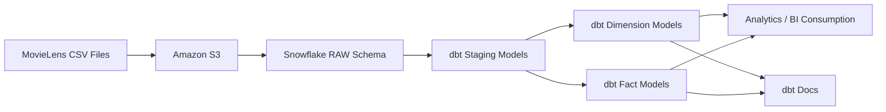
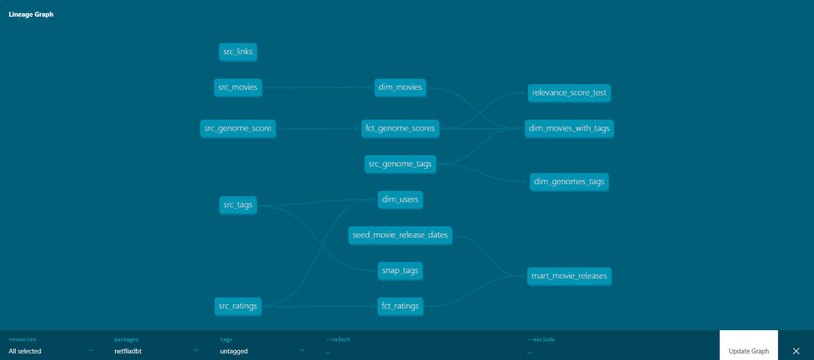
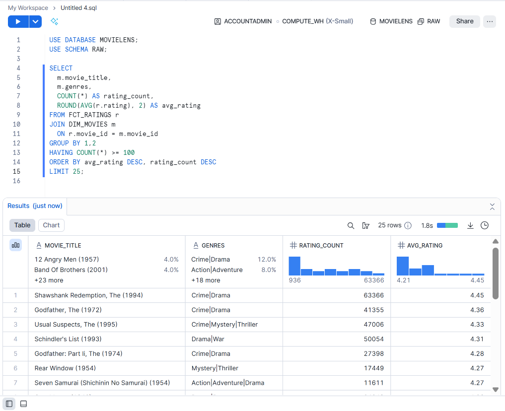
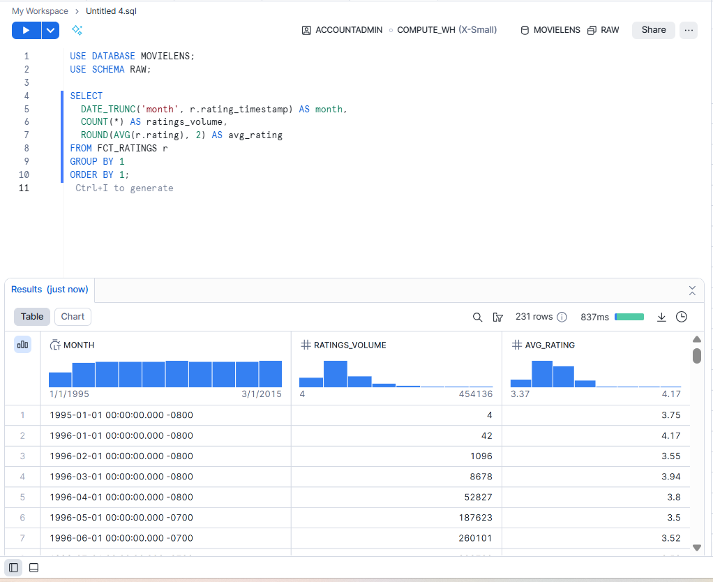
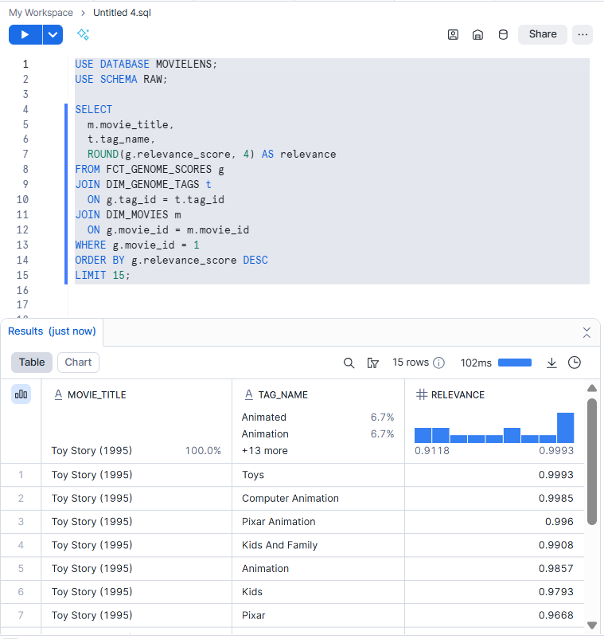
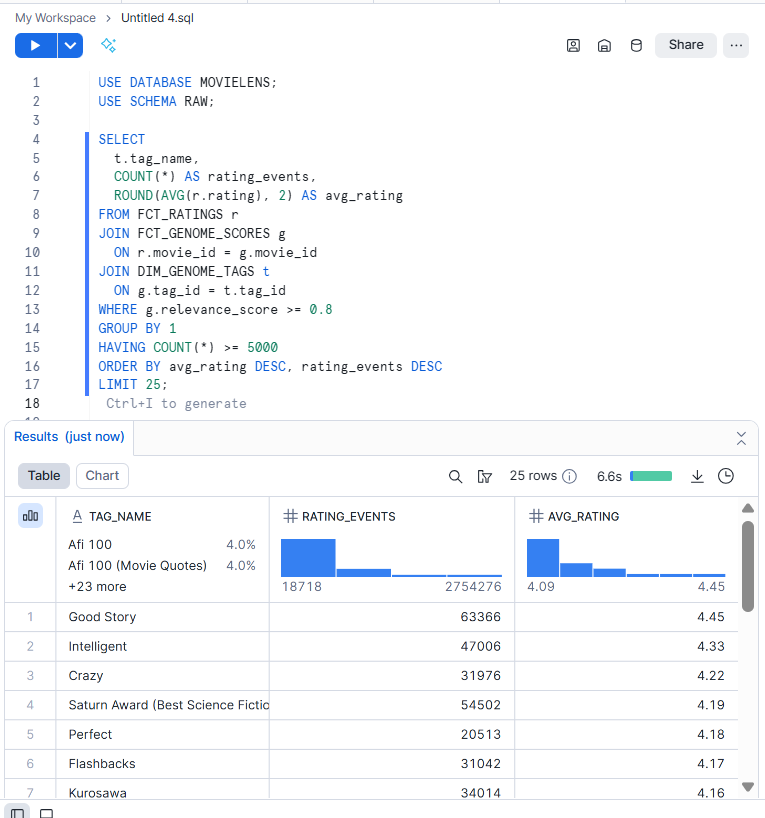

# 🎬 Netflix Analytics Engineering Project (dbt + Snowflake)

## 📌 Project Overview
This project demonstrates an **end-to-end Analytics Engineering workflow** using **dbt** and **Snowflake**, built on top of the **MovieLens dataset** to simulate a real-world **Netflix-like platform**.

The objective of this project is to showcase how raw data can be transformed into **analytics-ready fact and dimension tables** using modern data engineering best practices.

---

## 🧾 Project Summary

### What this project is:
I designed and implemented this project end-to-end, including data ingestion, modeling, testing, documentation, and analytics validation. The project demonstrates how to take raw CSV files (ratings, movies, tags, genome data), load them into a warehouse, and transform them into **clean, trusted, analytics-ready tables** that can be used by business stakeholders, dashboards, and downstream analytics.

---

### What the data is
The MovieLens dataset represents real user behavior on a streaming platform and includes:

- **ratings.csv**: user ratings for movies (user_id, movie_id, rating, timestamp)
- **movies.csv**: movie metadata (title, genres)
- **tags.csv**: user-generated tags applied to movies (free-text metadata)
- **links.csv**: mapping to external IDs (IMDb)
- **genome-tags.csv**: standardized tag dictionary (tag_id, tag)
- **genome-scores.csv**: tag relevance scores per movie (movie_id, tag_id, relevance)

Together, this data mimics what a streaming platform would need to analyze engagement, content performance, and recommendation signals.

---

### The problem this project solves
Raw datasets are not immediately usable for analytics because they typically:
- contain inconsistent formatting and naming
- mix raw operational structure with analytics needs
- are hard to query repeatedly without standardized models
- lack documentation, lineage, and consistent definitions

This project solves that by creating a **layered modeling system** that converts raw source data into well-defined tables that are easier to trust, query, and scale.

---

### Primary use cases
This modeled dataset can support analytics such as:
- Which movies are most highly rated, and how does this vary by genre?
- How do users interact with content over time (rating trends)?
- What tags best describe a movie (genome relevance), and how does that relate to engagement?
- Which genres or tag clusters are associated with higher ratings?

---

### Who would use the final structured data
The final tables are designed for:
- **Data Analysts / BI Analysts** building dashboards and insights
- **Product Analysts** measuring content engagement and user behavior
- **Data Scientists / ML Engineers** using ratings + tags + genome scores for recommendation features
- **Business stakeholders** consuming KPIs through BI tools (Power BI/Tableau)

In a real Netflix-like environment, this is the type of structured layer that sits between raw data ingestion and reporting/ML.

---

### Data modeling approach
This project follows a common warehouse pattern:

1) **RAW layer** (unchanged source-of-truth)  
2) **STAGING layer** (clean, standardized, lightly transformed views)  
3) **CORE/MART layer** (business-friendly dimensional models: facts + dimensions)

This approach is used because it:
- preserves raw data for audit/debugging
- isolates cleaning logic into a single place (staging)
- makes final tables consistent and reusable across teams
- improves maintainability and reduces “one-off” SQL logic in dashboards

---

### What tables/views were built
This dbt project produces:
- **Staging models (`src_*`)**: clean versions of raw tables (standardized columns, types, null handling)
- **Dimension models (`dim_*`)**: descriptive “lookup” tables used across analytics
- **Fact models (`fct_*`)**: event/transaction-style tables used for metrics and trend analysis

---

### RAW → STAGING
**Raw data is not modified directly.** Instead, staging models create a clean interface for downstream modeling. Typical transformations include:
- renaming columns to consistent case naming
- type casting (timestamps, numeric fields)
- removing obvious invalid records (e.g., null ratings)
- normalizing string fields (trim, standard casing)
- ensuring each model has a clear grainularity

**Why:**  
Staging creates a trusted “contract” so all downstream tables rely on consistent definitions.

---

### STAGING → DIMENSIONS/FACTS
After staging, the project creates analytics-friendly tables:

#### Dimension tables (examples)
- **dim_movies**: one row per movie with clean title + genre information  
  *Why:* reusable movie metadata for any analysis
- **dim_users**: one row per user derived from platform activity (ratings and tags)  
  *Why:* consistent user identity table for joins and user-level analysis
- **dim_genomes_tags**: cleaned tag dictionary (tag_id → standardized tag_name)  
  *Why:* makes genome tag analysis readable and consistent

#### Fact tables (examples)
- **fct_ratings**: one row per rating event (user_id + movie_id + rating + timestamp)  
  *Why:* supports engagement and time-series analysis
- **fct_genome_scores**: one row per movie-tag relevance score  
  *Why:* enables content similarity and tag-based feature engineering

**Why facts and dims:**  
This is BI modeling where:
- facts hold measurable events
- dimensions provide context and attributes

---

### Materialization choices
Different models can be materialized differently depending on performance and use case:

- **Views (commonly used for staging)**  
  *Why:* staging logic is light and can remain flexible; avoids extra storage
- **Tables (commonly used for dimensions)**  
  *Why:* dimensions are reused often; tables improve join performance and stability
- **Incremental models (commonly used for large fact tables like ratings)**  
  *Why:* only new data is processed on re-runs; scalable for growing datasets

Materialization is chosen to balance:
- performance
- compute cost
- maintainability
- refresh speed
  
This materialization strategy mirrors how production analytics pipelines balance flexibility in early layers with performance and stability in downstream reporting layers.
---

### Data quality + documentation
This project supports professional dbt practices such as:
- **dbt Docs** for autogenerated documentation and lineage
- **schema.yml descriptions** and tests
- repeatable transformation logic using `ref()` and `source()`

**Why this matters:**  
A big part of analytics engineering is making datasets reliable and explainable so other teams can confidently use them.

---

### Final outcome
At the end of this project, the result is a Snowflake-based analytics layer that:
- is structured for reporting and analysis (facts + dimensions)
- is easy to maintain and extend using dbt
- provides documentation and model lineage through dbt Docs
- supports scalable refresh patterns (including incremental loads)

This project demonstrates how modern analytics teams transform raw data into a reusable, trusted warehouse layer that powers dashboards, insights, and ML features.

---

## 🏗️ Architecture Overview

MovieLens CSV Files  
→ Amazon S3 (Raw Storage)  
→ Snowflake RAW Schema  
→ dbt Staging Models  
→ dbt Dimension & Fact Models  
→ Analytics + dbt Docs

---

## 🏛️ Architecture Diagram



- Raw CSV data is stored in **Amazon S3**
- Data is loaded into **Snowflake RAW schema**
- **dbt staging models** clean and standardize raw data
- **Dimension and fact models** support analytics use cases
- **dbt Docs** provides lineage and documentation

---

## 📂 Dataset Used
**MovieLens Dataset**
https://grouplens.org/datasets/movielens/20m/

Files:
- `ratings.csv` – User ratings with timestamps  
- `movies.csv` – Movie titles and genres  
- `tags.csv` – User-generated tags  
- `links.csv` – External references (IMDb, TMDB)  
- `genome-tags.csv` – Tag definitions  
- `genome-scores.csv` – Tag relevance scores per movie  

---

## ⚙️ Tools & Technologies
- dbt Core
- Snowflake
- Amazon S3
- SQL
- YAML
- GitHub

---

## 🧩 Project Structure

```
netflixdbt/
│
├── analyses/
├── models/
│   ├── sources/
│   ├── staging/
│   ├── dimensions/
│   └── facts/
│
├── screenshots/
│   ├── 01_project_structure.png
│   ├── 02_dbt_run_success.png
│   ├── 03_snowflake_raw_tables.png
│   ├── 04_snowflake_dev_schema.png
│   ├── 05_dbt_docs_lineage.png
│   └── 06_dbt_docs_model.png
│
├── seeds/
├── dbt_project.yml
├── packages.yml
└── README.md
```

---

## 🧱 Data Modeling Layers

### 1️⃣ Raw Layer
- CSV files loaded into Snowflake without modification
- Acts as a permanent source of truth

### 2️⃣ Staging Layer (`src_*`)
- Column renaming
- Data type casting
- Basic data quality cleanup

### 3️⃣ Dimension Tables
- `dim_movies`
- `dim_users`
- `dim_genome_tags`

### 4️⃣ Fact Tables
- `fct_ratings`
- `fct_genome_scores`

---

## 🧠 Key dbt Models & SQL Logic

Below are selected SQL snippets from this project that demonstrate how dbt models were built
using staging layers, reusable references, and dimensional modeling best practices.

### 🔹 Staging Model – Movies (`src_movies.sql`)

```sql
select
    movie_id,
    title,
    genres
from {{ source('netflix', 'movies') }}
```

---

### 🔹 Dimension Model – Movies (`dim_movies.sql`)

```sql
{{ config(materialized='table') }}

select
    movie_id,
    title,
    genres
from {{ ref('src_movies') }}
```

---

### 🔹 Fact Model – Ratings (`fct_ratings.sql`)

```sql
{{ config(materialized='incremental') }}

select
    user_id,
    movie_id,
    rating,
    rating_timestamp
from {{ ref('src_ratings') }}


where rating_timestamp >
    (select max(rating_timestamp) from {{ this }})

```

---

### 🔹 Dimension Model – Users (`dim_users.sql`)

```sql
with ratings_users as (
    select distinct user_id from {{ ref('src_ratings') }}
),
tag_users as (
    select distinct user_id from {{ ref('src_tags') }}
)

select distinct user_id
from ratings_users
union
select distinct user_id
from tag_users
```

---

## 🖥️ dbt Commands Used (VS Code Terminal)

Below are the key dbt commands used during development, testing, and documentation of this project.

### 🔹 Initialize dbt Project
```bash
dbt init netflixdbt
```
Creates the dbt project structure and configuration files.

---

### 🔹 Install dbt Dependencies
```bash
dbt deps
```
Installs dbt packages defined in `packages.yml`.

---

### 🔹 Run All Models
```bash
dbt run
```
Executes all dbt models (staging, dimensions, facts) in dependency order.

---

### 🔹 Run a Specific Model
```bash
dbt run --select dim_movies
```
Runs an individual model for targeted development and debugging.

---

### 🔹 Run Models with Upstream Dependencies
```bash
dbt run --select +fct_ratings
```
Runs a model along with all its upstream dependencies.

---

### 🔹 Test Data Quality
```bash
dbt test
```
Executes schema tests such as `not_null` and `unique` defined in `schema.yml`.

---

### 🔹 Generate dbt Documentation
```bash
dbt docs generate
```
Builds metadata and lineage information for all models.

---

### 🔹 Serve dbt Docs Locally
```bash
dbt docs serve
```
Launches an interactive documentation website locally to explore models and lineage.

---


## 📸 Screenshots

### 🔹 Project Folder Structure


### 🔹 dbt Run – Successful Execution


### 🔹 Snowflake RAW Tables


### 🔹 Snowflake View Schema


### 🔹 dbt Docs – Lineage Graph


---

## 📘 dbt Documentation

```bash
dbt docs generate
dbt docs serve
```

This launches an interactive documentation site showing:
- Model lineage
- Column descriptions
- Dependencies
- Source freshness

---

## ✅ Analytics Queries (Executed in Snowflake)

Each screenshot below shows the **SQL query** and the **output results** executed in Snowflake using the final dbt models in `MOVIELENS.RAW`.

### 1) Which movies are most highly rated, and how does this vary by genre?


### 2) How do users interact with content over time (rating trends)?


### 3) What tags best describe a movie (genome relevance)?


### 4) Which tags are associated with higher ratings?


---

## 🎯 What This Project Demonstrates
- End-to-end analytics engineering workflow
- dbt best practices and modular modeling
- Snowflake-based data warehouse design
- Dimensional modeling (facts & dimensions)
- Documentation-driven analytics

---

## 📌 Future Enhancements
- Incremental models for large fact tables
- dbt tests for data quality
- CI/CD using GitHub Actions
- BI tool integration (Power BI / Tableau)

---

## 👤 Author
**Kushal Jain**  
MS in Information Systems  
Analytics Engineering | Data Engineering | BI
https://www.linkedin.com/in/kushaljaink/
