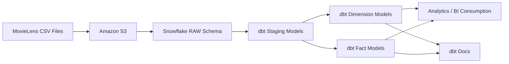

# 🎬 Netflix Analytics Engineering Project (dbt + Snowflake)

## 📌 Project Overview
This project demonstrates an **end-to-end Analytics Engineering workflow** using **dbt** and **Snowflake**, built on top of the **MovieLens dataset** to simulate a real-world **Netflix-like analytics platform**.

The objective of this project is to showcase how raw data can be transformed into **analytics-ready fact and dimension tables** using modern data engineering best practices.

---

## 🧠 Business Context
Netflix-style platforms generate massive volumes of data such as:
- User ratings and engagement events
- Movie metadata and genres
- User-generated tags and feedback
- External movie references (IMDb, TMDB)

Analytics teams rely on clean, reliable, and well-modeled datasets to power dashboards, experimentation, and downstream machine learning use cases.

---

## 🏗️ Architecture Overview

MovieLens CSV Files  
→ Amazon S3 (Raw Storage)  
→ Snowflake RAW Schema  
→ dbt Staging Models  
→ dbt Dimension & Fact Models  
→ Analytics Consumption + dbt Docs

---

## 🏛️ Architecture Diagram



### Architecture Notes
- Raw CSV data is stored in **Amazon S3**
- Data is loaded into **Snowflake RAW schema**
- **dbt staging models** clean and standardize raw data
- **Dimension and fact models** support analytics use cases
- **dbt Docs** provides lineage and documentation

---

## 📂 Dataset Used
**MovieLens 20M Dataset**

Files:
- `ratings.csv` – User ratings with timestamps  
- `movies.csv` – Movie titles and genres  
- `tags.csv` – User-generated tags  
- `links.csv` – External references (IMDb, TMDB)  
- `genome-tags.csv` – Tag definitions  
- `genome-scores.csv` – Tag relevance scores per movie  

---

## ⚙️ Tools & Technologies
- dbt Core
- Snowflake
- Amazon S3
- SQL
- YAML
- GitHub

---

## 🧩 Project Structure

```
netflixdbt/
│
├── analyses/
├── models/
│   ├── sources/
│   ├── staging/
│   ├── dimensions/
│   └── facts/
│
├── screenshots/
│   ├── 01_project_structure.png
│   ├── 02_dbt_run_success.png
│   ├── 03_snowflake_raw_tables.png
│   ├── 04_snowflake_dev_schema.png
│   ├── 05_dbt_docs_lineage.png
│   └── 06_dbt_docs_model.png
│
├── seeds/
├── dbt_project.yml
├── packages.yml
└── README.md
```

---

## 🧱 Data Modeling Layers

### 1️⃣ Raw Layer
- CSV files loaded into Snowflake without modification
- Acts as a permanent source of truth

### 2️⃣ Staging Layer (`src_*`)
- Column renaming
- Data type casting
- Basic data quality cleanup

### 3️⃣ Dimension Tables
- `dim_movies`
- `dim_users`
- `dim_genome_tags`

### 4️⃣ Fact Tables
- `fct_ratings`
- `fct_genome_scores`

---

## 🧠 Key dbt Models & SQL Logic

Below are selected SQL snippets from this project that demonstrate how dbt models were built
using staging layers, reusable references, and dimensional modeling best practices.

### 🔹 Staging Model – Movies (`src_movies.sql`)

```sql
select
    movie_id,
    title,
    genres
from {{ source('netflix', 'movies') }}
```

---

### 🔹 Dimension Model – Movies (`dim_movies.sql`)

```sql
{{ config(materialized='table') }}

select
    movie_id,
    title,
    genres
from {{ ref('src_movies') }}
```

---

### 🔹 Fact Model – Ratings (`fct_ratings.sql`)

```sql
{{ config(materialized='incremental') }}

select
    user_id,
    movie_id,
    rating,
    rating_timestamp
from {{ ref('src_ratings') }}


where rating_timestamp >
    (select max(rating_timestamp) from {{ this }})

```

---

### 🔹 Dimension Model – Users (`dim_users.sql`)

```sql
with ratings_users as (
    select distinct user_id from {{ ref('src_ratings') }}
),
tag_users as (
    select distinct user_id from {{ ref('src_tags') }}
)

select distinct user_id
from ratings_users
union
select distinct user_id
from tag_users
```

---

## 🖥️ dbt Commands Used (VS Code Terminal)

Below are the key dbt commands used during development, testing, and documentation of this project.

### 🔹 Initialize dbt Project
```bash
dbt init netflixdbt
```
Creates the dbt project structure and configuration files.

---

### 🔹 Install dbt Dependencies
```bash
dbt deps
```
Installs dbt packages defined in `packages.yml`.

---

### 🔹 Run All Models
```bash
dbt run
```
Executes all dbt models (staging, dimensions, facts) in dependency order.

---

### 🔹 Run a Specific Model
```bash
dbt run --select dim_movies
```
Runs an individual model for targeted development and debugging.

---

### 🔹 Run Models with Upstream Dependencies
```bash
dbt run --select +fct_ratings
```
Runs a model along with all its upstream dependencies.

---

### 🔹 Test Data Quality
```bash
dbt test
```
Executes schema tests such as `not_null` and `unique` defined in `schema.yml`.

---

### 🔹 Generate dbt Documentation
```bash
dbt docs generate
```
Builds metadata and lineage information for all models.

---

### 🔹 Serve dbt Docs Locally
```bash
dbt docs serve
```
Launches an interactive documentation website locally to explore models and lineage.

---


## 📸 Screenshots

### 🔹 Project Folder Structure


### 🔹 dbt Run – Successful Execution


### 🔹 Snowflake RAW Tables


### 🔹 Snowflake DEV Schema


### 🔹 dbt Docs – Lineage Graph


---

## 📘 dbt Documentation

```bash
dbt docs generate
dbt docs serve
```

This launches an interactive documentation site showing:
- Model lineage
- Column descriptions
- Dependencies
- Source freshness

---

## 🚀 How to Run the Project

1. Upload MovieLens CSV files to Amazon S3  
2. Load raw data into Snowflake  
3. Initialize the dbt project  
4. Configure Snowflake profile  
5. Run transformations:
```bash
dbt run
```

---

## 🎯 What This Project Demonstrates
- End-to-end analytics engineering workflow
- dbt best practices and modular modeling
- Snowflake-based data warehouse design
- Dimensional modeling (facts & dimensions)
- Documentation-driven analytics

---

## 📌 Future Enhancements
- Incremental models for large fact tables
- dbt tests for data quality
- CI/CD using GitHub Actions
- BI tool integration (Power BI / Tableau)

---

## 👤 Author
**Kushal Jain**  
MS in Information Systems (Business Analytics)  
Analytics Engineering | Data Engineering | BI
