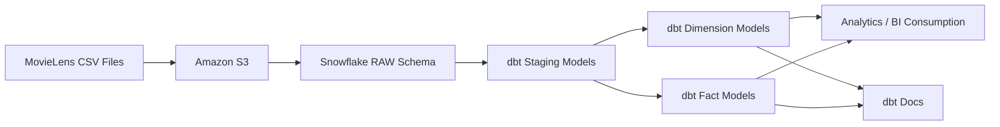

# 🎬 Netflix Analytics Engineering Project (dbt + Snowflake)

## 📌 Project Overview
This project demonstrates an **end-to-end Analytics Engineering workflow** using **dbt** and **Snowflake**, built on top of the **MovieLens dataset** to simulate a real-world **Netflix-like analytics platform**.

The objective of this project is to showcase how raw data can be transformed into **analytics-ready fact and dimension tables** using modern data engineering best practices.

---

## 🧠 Business Context
Netflix-style platforms generate massive volumes of data such as:
- User ratings and engagement events
- Movie metadata and genres
- User-generated tags and feedback
- External movie references (IMDb, TMDB)

Analytics teams rely on clean, reliable, and well-modeled datasets to power dashboards, experimentation, and downstream machine learning use cases.

---

## 🏗️ Architecture Overview

MovieLens CSV Files  
→ Amazon S3 (Raw Storage)  
→ Snowflake RAW Schema  
→ dbt Staging Models  
→ dbt Dimension & Fact Models  
→ Analytics Consumption + dbt Docs

---

## 🏛️ Architecture Diagram



---

## ⚙️ Tools & Technologies
- dbt Core
- Snowflake
- Amazon S3
- SQL
- YAML
- GitHub

---

## 🧩 Project Structure

```
netflixdbt/
├── analyses/
├── models/
│   ├── sources/
│   ├── staging/
│   ├── dimensions/
│   └── facts/
├── screenshots/
├── seeds/
├── dbt_project.yml
├── packages.yml
└── README.md
```

---

## 🧠 Key dbt Models & SQL Logic

### 🔹 Staging Model – Movies (`src_movies.sql`)
```sql
select
    movie_id,
    title,
    genres
from {{ source('netflix', 'movies') }}
```

### 🔹 Dimension Model – Movies (`dim_movies.sql`)
```sql
{{ config(materialized='table') }}

select
    movie_id,
    title,
    genres
from {{ ref('src_movies') }}
```

### 🔹 Fact Model – Ratings (`fct_ratings.sql`)
```sql
{{ config(materialized='incremental') }}

select
    user_id,
    movie_id,
    rating,
    rating_timestamp
from {{ ref('src_ratings') }}


where rating_timestamp >
    (select max(rating_timestamp) from {{ this }})

```

---

## 🖥️ dbt Commands Used (VS Code Terminal)

Below are the key dbt commands used during development, testing, and documentation of this project.

### 🔹 Initialize dbt Project
```bash
dbt init netflixdbt
```
Creates the dbt project structure and configuration files.

---

### 🔹 Install dbt Dependencies
```bash
dbt deps
```
Installs dbt packages defined in `packages.yml`.

---

### 🔹 Run All Models
```bash
dbt run
```
Executes all dbt models (staging, dimensions, facts) in dependency order.

---

### 🔹 Run a Specific Model
```bash
dbt run --select dim_movies
```
Runs an individual model for targeted development and debugging.

---

### 🔹 Run Models with Upstream Dependencies
```bash
dbt run --select +fct_ratings
```
Runs a model along with all its upstream dependencies.

---

### 🔹 Test Data Quality
```bash
dbt test
```
Executes schema tests such as `not_null` and `unique` defined in `schema.yml`.

---

### 🔹 Generate dbt Documentation
```bash
dbt docs generate
```
Builds metadata and lineage information for all models.

---

### 🔹 Serve dbt Docs Locally
```bash
dbt docs serve
```
Launches an interactive documentation website locally to explore models and lineage.

---

## 📸 Screenshots

Screenshots in this repository include:
- Project folder structure
- Successful `dbt run` execution
- Snowflake RAW and DEV schemas
- dbt Docs lineage and model documentation

All screenshots are stored in the `/screenshots` folder.

---

## 🎯 What This Project Demonstrates
- End-to-end analytics engineering workflow
- dbt best practices and modular modeling
- Snowflake-based data warehouse design
- Incremental fact modeling
- Documentation-driven analytics

---

## 👤 Author
**Kushal Jain**  
MS in Information Systems (Business Analytics)  
Analytics Engineering | Data Engineering | BI
