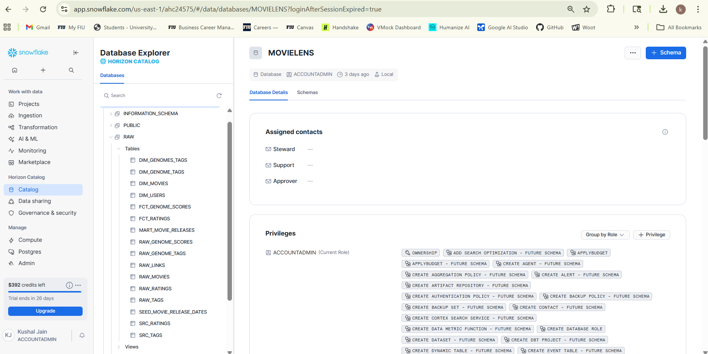
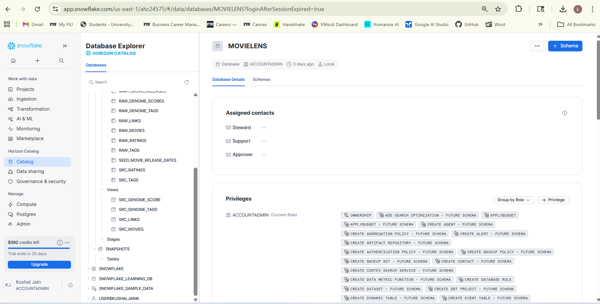

# 🎬 Netflix Analytics Engineering Project (dbt + Snowflake)

## 📌 Project Overview
This project demonstrates an **end-to-end Analytics Engineering workflow** using **dbt** and **Snowflake**, built on top of the **MovieLens dataset** to simulate a real-world **Netflix-like analytics platform**.

The objective of this project is to showcase how raw data can be transformed into **analytics-ready fact and dimension tables** using modern data engineering best practices.

---

## 🧠 Business Context
Netflix-style platforms generate massive volumes of data such as:
- User ratings and engagement events
- Movie metadata and genres
- User-generated tags and feedback
- External movie references (IMDb, TMDB)

Analytics teams rely on clean, reliable, and well-modeled datasets to power dashboards, experimentation, and downstream machine learning use cases.

---

## 🏗️ Architecture Overview

MovieLens CSV Files  
→ Amazon S3 (Raw Storage)  
→ Snowflake RAW Schema  
→ dbt Staging Models (SRC)  
→ dbt Dimension & Fact Models (DEV)  
→ dbt Docs (Auto-generated Documentation)

---

## 📂 Dataset Used
**MovieLens 20M Dataset**

Files:
- `ratings.csv` – User ratings with timestamps  
- `movies.csv` – Movie titles and genres  
- `tags.csv` – User-generated tags  
- `links.csv` – External references (IMDb, TMDB)  
- `genome-tags.csv` – Tag definitions  
- `genome-scores.csv` – Tag relevance scores per movie  

---

## ⚙️ Tools & Technologies
- dbt Core
- Snowflake
- Amazon S3
- SQL
- YAML
- GitHub

---

## 🧩 Project Structure

```
netflixdbt/
│
├── models/
│   ├── sources/
│   ├── staging/
│   ├── dimensions/
│   └── facts/
│
├── screenshots/
│   ├── 01_project_structure.png
│   ├── 02_dbt_run_success.png
│   ├── 03_snowflake_raw_tables.png
│   ├── 04_snowflake_dev_schema.png
│   ├── 05_dbt_docs_lineage.png
│   └── 06_dbt_docs_model.png
│
├── dbt_project.yml
├── packages.yml
├── profiles.yml
└── README.md
```

---

## 🧱 Data Modeling Layers

### 1️⃣ Raw Layer
- CSV files loaded into Snowflake without modification
- Acts as a permanent source of truth

### 2️⃣ Staging Layer (`src_*`)
- Column renaming
- Data type casting
- Basic data quality cleanup

### 3️⃣ Dimension Tables
- `dim_movies`
- `dim_users`
- `dim_genome_tags`

### 4️⃣ Fact Tables
- `fct_ratings`
- `fct_genome_scores`

---

## 📸 Screenshots

> All screenshots are stored inside the `/screenshots` folder.

### 🔹 Project Folder Structure


### 🔹 dbt Run – Successful Execution


### 🔹 Snowflake RAW Tables


### 🔹 Snowflake DEV Schema


### 🔹 dbt Docs – Lineage Graph


---

## 📘 dbt Documentation
Generate interactive documentation using:
```
dbt docs generate
dbt docs serve
```

This launches a local web UI that shows:
- Model lineage
- Column descriptions
- Dependencies
- Source freshness

---

## 🚀 How to Run the Project

1. Upload MovieLens CSV files to Amazon S3  
2. Load raw data into Snowflake  
3. Initialize the dbt project  
4. Configure Snowflake profile  
5. Run transformations:
```
dbt run
```
6. Generate dbt documentation

---

## 🎯 What This Project Demonstrates
- End-to-end analytics engineering workflow
- dbt best practices and modular modeling
- Snowflake-based data warehouse design
- Dimensional modeling (facts & dimensions)
- Documentation-driven analytics

---

## 📌 Future Enhancements
- Incremental models for large fact tables
- dbt tests for data quality
- CI/CD using GitHub Actions
- BI tool integration (Power BI / Tableau)

---

## 👤 Author
**Kushal Jain**  
MS in Information Systems (Business Analytics)  
Analytics Engineering | Data Engineering | BI
